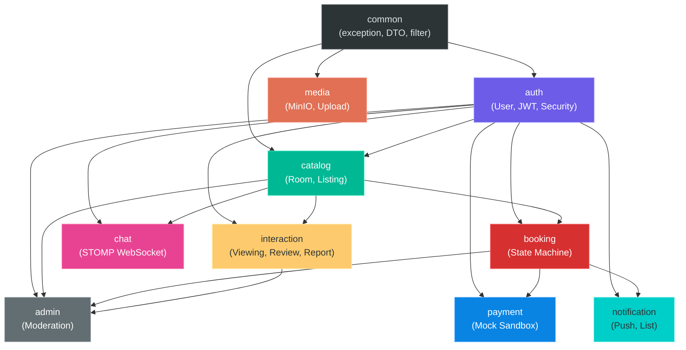
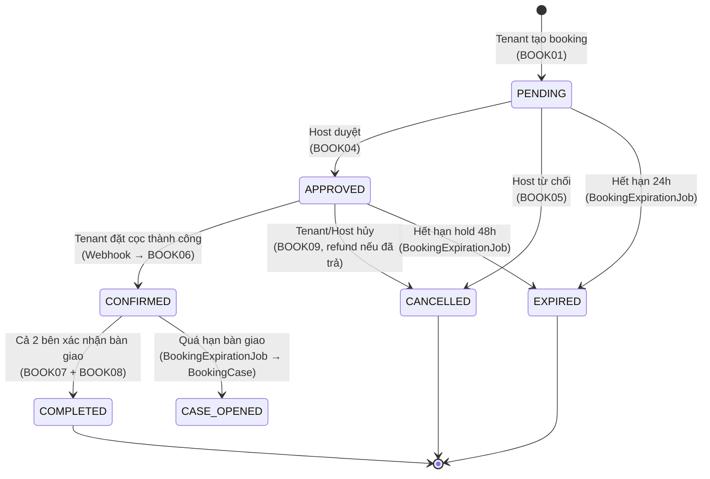
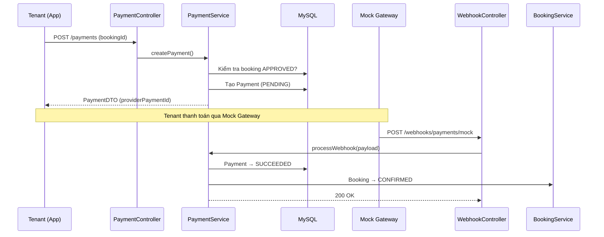
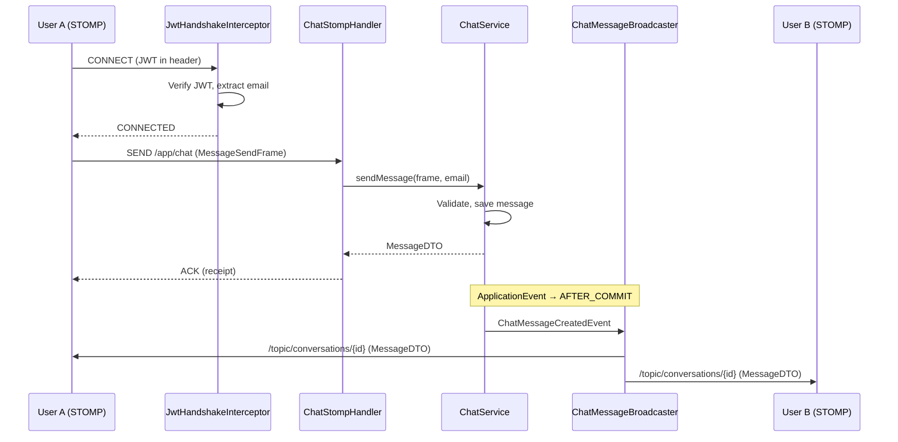
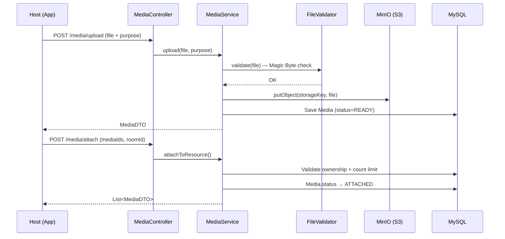

# 📋 ĐÁNH GIÁ TOÀN DIỆN DỰ ÁN — Room Rental System

> **Đối chiếu source sau khắc phục ngày 04/10/2026:** P0/P1/P2 đã được xử lý. Theo yêu cầu mới của người dùng, contract v1.5 dùng global HTTP wrapper `{statusCode,message,data}`. Bản này đạt 205 test backend và 6 unit test Android; JAR/APK/lint thành công, HTTP workflow PASS, OpenAPI 83 paths đã kiểm tra references. Xem [GLOBAL_RESPONSE_WRAPPER.md](GLOBAL_RESPONSE_WRAPPER.md). Nhận xét “không có test”, “notification chưa tích hợp” và bảng điểm cũ bên dưới là lịch sử.

**Ngày đánh giá:** 04/10/2026  
**Người đánh giá:** AI Code Assistant  
**Phiên bản Contract đối chiếu:** v1.5
**Tech Stack:** Java 17 · Spring Boot 3.3.x · Maven · MySQL 8.4 · MinIO · STOMP WebSocket

---

## 1. 📊 Tổng quan dự án

| Chỉ số | Giá trị |
|--------|---------|
| **Tổng file Java** | ~200 files |
| **Số module nghiệp vụ** | 10 (auth, catalog, media, interaction, booking, payment, chat, notification, admin, common) |
| **Số Flyway migration** | 13 files (V1 → V13) |
| **Số API endpoint** | ~60+ endpoints |
| **Kiến trúc** | Modular Monolith |
| **Tiến độ** | 8/8 Phase hoàn thành ✅ |

---

## 2. 🏗️ Cấu trúc dự án & Nguyên lý phân chia

### 2.1 Nguyên lý tổ chức: **Package by Feature (Module)**

Dự án sử dụng kiểu **Package by Feature** (còn gọi là Modular Monolith), nghĩa là mỗi tính năng nghiệp vụ (feature/domain) được gom vào một package riêng biệt, bên trong mỗi package lại chia theo layer kỹ thuật.

```
com.homely.rental/
├── RentalApplication.java          ← Entry point
│
├── common/                         ← Shared infrastructure
│   ├── audit/                      (AuditLog, AuditLogRepository)
│   ├── config/                     (CorsConfig, v.v.)
│   ├── dto/                        (RestResponse, ProblemDTO, PageResponse, FieldErrorDTO)
│   ├── entity/                     (AbstractAuditingEntity)
│   ├── exception/                  (GlobalException, IdInvalidException, ConflictException, ...)
│   ├── idempotency/                (IdempotencyFilter, IdempotencyKeyEntity)
│   └── response/                   (FormatRestResponse, ApiProblems, ApiErrorController)
│
├── auth/                           ← P1: Authentication & User
│   ├── constant/                   (UserStatus)
│   ├── controller/                 (AuthController, ProfileController)
│   ├── dto/                        (request/, response/)
│   ├── entity/                     (User, Role, RoleName, RefreshToken, OneTimeToken, DeviceToken, ...)
│   ├── repository/
│   ├── security/                   (SecurityConfig, JwtFilter, SecurityUtils, AccountStateFilter, ...)
│   └── service/                    (AuthService, TokenService, EmailService, ...)
│
├── catalog/                        ← P2: Room + Listing + Discovery
│   ├── controller/                 (RoomController, ListingController, WishlistController, ...)
│   ├── dto/
│   ├── entity/                     (Room, Listing, ListingStatus, ListingFee, Amenity, Address, ...)
│   ├── job/                        (ListingExpirationJob)
│   ├── repository/
│   └── service/                    (RoomService, ListingService, ...)
│
├── media/                          ← P3: Media Upload
│   ├── config/                     (MinIOConfig)
│   ├── controller/                 (MediaController)
│   ├── dto/
│   ├── entity/                     (Media, MediaPurpose, MediaStatus)
│   ├── job/                        (OrphanMediaCleanupJob)
│   ├── repository/
│   ├── service/                    (MediaService, StorageService)
│   └── validation/                 (FileValidator — Magic Byte check)
│
├── interaction/                    ← P4: Viewing + Review + Report
│   ├── controller/                 (ViewingController, ReviewController, ReportController)
│   ├── dto/
│   ├── entity/                     (Viewing, ViewingSlot, Review, Report, ReportStatus)
│   ├── repository/
│   └── service/                    (ViewingService, ReviewService, ReportService)
│
├── booking/                        ← P5: Booking & State Machine
│   ├── controller/                 (BookingController)
│   ├── dto/
│   ├── entity/                     (Booking, BookingStatus, BookingStatusHistory, BookingCase, ...)
│   ├── job/                        (BookingExpirationJob)
│   ├── repository/
│   └── service/                    (BookingService, BookingLocks, BookingTransitions)
│
├── payment/                        ← P6: Payment (Mock Sandbox)
│   ├── controller/                 (PaymentController, WebhookController)
│   ├── dto/                        (PaymentDTO, PaymentCreateRequest, WebhookPayload)
│   ├── entity/                     (Payment, PaymentStatus, Refund, RefundReason, RefundStatus, ...)
│   ├── repository/
│   └── service/                    (PaymentService, RefundService)
│
├── chat/                           ← P7: Chat & WebSocket
│   ├── controller/                 (ChatController)
│   ├── dto/
│   ├── entity/                     (Conversation, Message, ReadMarker, MessageContentType)
│   ├── repository/
│   ├── security/                   (ChatHttpGuardFilter)
│   ├── service/                    (ChatService, ChatException)
│   └── websocket/                  (StompConfig, ChatStompHandler, JwtHandshakeInterceptor, ...)
│
├── notification/                   ← P8: Notification
│   ├── controller/                 (NotificationController)
│   ├── dto/                        (NotificationDTO)
│   ├── entity/                     (Notification, NotificationType)
│   ├── repository/
│   └── service/                    (NotificationService)
│
└── admin/                          ← P8: Admin
    ├── controller/                 (AdminController)
    └── service/                    (AdminService)
```

### 2.2 Tại sao chọn Package by Feature?

| Tiêu chí | Package by Layer (Truyền thống) | Package by Feature (Dự án này) |
|-----------|--------------------------------|-------------------------------|
| Cấu trúc | `controller/`, `service/`, `entity/` — gom tất cả | Mỗi feature tự quản |
| Cohesion | Thấp (file liên quan nằm xa nhau) | Cao (file liên quan gom chung) |
| Dễ tách microservice? | Khó — phải tách từ nhiều folder | Dễ — cắt nguyên package |
| Navigate code | Khó khi dự án lớn | Dễ — chỉ cần vào đúng module |

---

## 3. 🔄 Sơ đồ luồng logic (Flow Diagrams)

### 3.1 Sơ đồ tổng thể — Module Dependency Graph



### 3.2 Booking State Machine — Luồng logic phức tạp nhất



### 3.3 Payment Flow — Luồng thanh toán Mock Sandbox



### 3.4 Chat WebSocket Flow — Luồng nhắn tin realtime



### 3.5 Media Upload Flow



---

## 4. ✅ Điểm mạnh

### 4.1 Kiến trúc & Thiết kế

| # | Điểm mạnh | Mô tả |
|---|-----------|-------|
| 1 | **Modular Monolith** | Chia module rõ ràng, dễ maintain, dễ tách microservice sau này |
| 2 | **State Machine rõ ràng** | Booking lifecycle được implement đầy đủ với history tracking qua `BookingStatusHistory` |
| 3 | **Concurrency Control** | Sử dụng `@Version` (Optimistic Locking) + `SELECT ... FOR UPDATE` (Pessimistic Locking) đúng chỗ |
| 4 | **Idempotency Filter** | POST mutations có idempotency key, tránh duplicate request |
| 5 | **Media Magic Byte validation** | Kiểm tra file thực sự bằng magic bytes, không chỉ dựa vào extension |
| 6 | **Terms Snapshot** | Booking lưu snapshot giá/điều kiện tại thời điểm đặt, tránh tranh chấp |
| 7 | **Chat Idempotency** | `client_message_id` (UUID) cho mỗi tin nhắn, chống gửi trùng |
| 8 | **Cursor-based Pagination cho Chat** | Sử dụng `sequence` thay vì offset pagination, hiệu quả với dữ liệu realtime |

### 4.2 Business Logic

| # | Điểm mạnh | Business Rule |
|---|-----------|---------------|
| 1 | **Self-action prevention** | Không cho host đặt phòng của chính mình (BR-01.3) |
| 2 | **Dual handover confirmation** | Cả tenant và host phải xác nhận bàn giao mới COMPLETED |
| 3 | **Auto-expiration** | Scheduled jobs tự hủy booking quá hạn, giải phóng room |
| 4 | **Dispute handling** | BookingCase system cho overdue handover |
| 5 | **Refund on cancellation** | Tự động refund khi host reject sau khi tenant đã trả cọc |

### 4.3 Security

| # | Điểm mạnh | Mô tả |
|---|-----------|-------|
| 1 | **Access vs Refresh token tách biệt** | `token_type` claim ngăn chặn dùng refresh token như access token |
| 2 | **Role-based access** | TENANT, HOST, ADMIN rõ ràng trong SecurityConfig |
| 3 | **Account state filter** | Chặn suspended/inactive user trước khi vào business logic |
| 4 | **WebSocket auth** | JWT verification trong STOMP handshake |
| 5 | **Rate limiting** | ChatHttpGuardFilter chặn spam REST endpoints |

---

## 5. ❌ Điểm yếu & Vấn đề cần khắc phục

### 5.1 🔴 VẤN ĐỀ NGHIÊM TRỌNG (Critical — Cần fix ngay)

#### C1: Global response wrapper đúng contract v1.5 — đã xử lý

Sau nghiệm thu P0 v1.4, người dùng yêu cầu dùng global wrapper để thống nhất cách đọc response. Đã triển khai lại `FormatRestResponse` và `RestResponse` cho HTTP JSON: `{statusCode,message,data}`. Wrapper chọn converter JSON/String, bọc một lần, giữ status thật và hỗ trợ cả null/string/page/array.

HTTP 200 không DTO có data=null; 204/205/304 không body; media giữ byte stream. Swagger/OpenAPI, Actuator và STOMP dùng giao thức riêng. Android, OpenAPI và contract đã nâng cấp đồng bộ; không chỉ bật supports() cho mọi loại response.

---

#### C2: Lỗi cùng envelope, data chứa ProblemDTO — đã xử lý

`ApiProblems` tạo ProblemDTO chung cho MVC, security/account/idempotency/chat và STOMP. HTTP dùng `application/json` envelope, message lấy từ detail, data chứa code/field_errors/trace_id/timestamp. STOMP giữ ProblemDTO trực tiếp.

`ApiErrorController` bao phủ servlet fallback. Status 4xx/5xx giữ nguyên, 405 giữ Allow, security giữ WWW-Authenticate, rate limit giữ Retry-After; không phản chiếu SQL/stack trace/rejected value vào response. Snapshot idempotency legacy được bọc khi replay và không chạy lại mutation.

Chi tiết và bằng chứng hiện tại tại [GLOBAL_RESPONSE_WRAPPER.md](GLOBAL_RESPONSE_WRAPPER.md): 205 test backend đạt, Android 6 unit test đạt, HTTP workflow PASS. Kết quả 199 test/DTO trực tiếp ở [P0_RESULTS.md](P0_RESULTS.md) là lịch sử v1.4.

---

#### C3: URL media theo cấu hình — đã xử lý

`MediaService` dùng `${apiPrefix:api/v1}` để sinh URL `/{apiPrefix}/media/{id}/content`; chuẩn hóa slash ở đầu/cuối khi tạo URL. OpenAPI dùng cùng prefix để xác định auth và idempotency.

Test kiểm tra URL mặc định, prefix tùy chỉnh, nội dung nhị phân và quyền đọc: người ngoài không đọc được media của tin ẩn hoặc upload riêng. Cấu hình production nên dùng prefix chuẩn như `api/v1` hoặc `custom/v2`.

---

### 5.2 🟡 VẤN ĐỀ QUAN TRỌNG (High — Nên fix sớm)

#### H1: Không có Unit Test / Integration Test

Toàn bộ 200 file Java không có **bất kỳ file test nào** (`src/test/java` trống hoặc chỉ có test mặc định). Đây là rủi ro lớn nhất khi maintain và refactor code.

#### H2: Thiếu DB migration cho `suspended` fields trên `users`

File `V13__add_user_suspended.sql` đã được tạo, nhưng cần verify rằng nó đã chạy thành công trên database thật. Nếu chưa chạy, User entity sẽ lỗi runtime khi truy xuất `suspended` / `suspendReason`.

#### H3: `getCurrentUser()` bị lặp ở mọi Service

Hầu hết mọi Service đều có đoạn code giống hệt nhau:
```java
private User getCurrentUser() throws IdInvalidException {
    String email = SecurityUtils.getCurrentUserLogin()
            .orElseThrow(() -> new IdInvalidException("Not authenticated"));
    User user = userRepository.findByEmail(email);
    if (user == null) throw new IdInvalidException("User not found");
    return user;
}
```

Đoạn này xuất hiện ở: `BookingService`, `PaymentService`, `ReviewService`, `ViewingService`, `ReportService`, `NotificationService`, `MediaService` — tổng cộng **~7 lần copy-paste**.

**Fix:** Tạo một `@Component UserResolver` chung, inject vào các Service.

#### H4: Payment module chưa có Payment Expiration Job

Trong `PaymentService`, payment có `expiresAt` nhưng không có scheduled job nào kiểm tra và chuyển PENDING → EXPIRED khi quá hạn.

#### H5: Notification chưa tích hợp vào business flow

`NotificationService.createNotification()` đã có sẵn nhưng chưa được gọi từ bất kỳ service nào (BookingService, ChatService, v.v.). Notification chỉ tồn tại API endpoint nhưng không có dữ liệu thực tế.

---

### 5.3 🟢 VẤN ĐỀ NHẸ (Low — Nên cải thiện)

| # | Vấn đề | Mô tả |
|---|--------|-------|
| L1 | **Thiếu Swagger/OpenAPI annotations** | Các Controller không có `@Operation`, `@ApiResponses` → Swagger UI thiếu thông tin |
| L2 | **Lombok `@Data` trên Entity** | Một số entity dùng `@Data` thay vì `@Getter @Setter` — có thể gây vấn đề với `hashCode()` và `equals()` khi sử dụng với JPA lazy loading |
| L3 | **Thiếu logging ở một số flow** | Các service nhỏ (Review, Report) thiếu `@Slf4j` logging |
| L4 | **Chưa có Dockerize** | Chưa có Dockerfile cho ứng dụng (chỉ có Docker Compose cho MySQL, MinIO) |
| L5 | **`AuditLog` chưa được sử dụng** | Entity và Repository đã tạo nhưng chưa có logic ghi audit log |
| L6 | **Chưa có CORS config cụ thể** | Nếu Frontend ở domain khác cần cấu hình CORS rõ ràng |

---

## 6. 📐 Đánh giá khả năng Scale (Mở rộng)

### 6.1 Scale theo chiều ngang (Horizontal Scaling)

| Yếu tố | Đánh giá | Ghi chú |
|---------|---------|---------|
| **Stateless API** | ✅ Tốt | JWT-based, không dùng session server-side |
| **WebSocket Scale** | ⚠️ Hạn chế | STOMP in-memory → chỉ 1 instance. Cần Redis pub/sub để scale |
| **Scheduled Jobs** | ⚠️ Hạn chế | `@Scheduled` chạy trên mọi instance → duplicate execution. Cần ShedLock hoặc Quartz |
| **Database** | ✅ Tốt | MySQL replication sẵn sàng, read-only queries đã annotate đúng |
| **File Storage** | ✅ Tốt | MinIO (S3-compatible) scale tốt |

### 6.2 Scale theo chiều dọc (Tách Microservice)

| Module | Dễ tách? | Lý do |
|--------|---------|-------|
| `chat` | ✅ Rất dễ | Chỉ phụ thuộc `auth` + `catalog` qua ID, có WebSocket riêng |
| `media` | ✅ Rất dễ | Chỉ cần MinIO + user authentication |
| `notification` | ✅ Rất dễ | Event-driven, có thể tách thành consumer riêng |
| `payment` | ✅ Dễ | Giao tiếp qua webhook, tách biệt tự nhiên |
| `booking` | ⚠️ Khó | Phụ thuộc chặt vào `catalog` (Room state), `payment` (refund) |
| `interaction` | ⚠️ Vừa | Review phụ thuộc Booking validation |

### 6.3 Kết luận về Scale

> **Dự án có khả năng scale TRUNG BÌNH.** Kiến trúc Modular Monolith là bước đệm tốt. Để scale thực sự cần:
> 1. Thêm Redis cho WebSocket pub/sub
> 2. Thêm ShedLock cho scheduled jobs
> 3. Event-driven integration giữa modules (Kafka/RabbitMQ) thay vì gọi trực tiếp service

---

## 7. 🏆 Điểm số tổng thể

> Bảng điểm bên dưới là nhận định lịch sử trước khắc phục; không dùng để mô tả bản hiện tại. P0 đã được xử lý tại [P0_RESULTS.md](P0_RESULTS.md), P1/P2 tại [P1_P2_RESULTS.md](P1_P2_RESULTS.md). Chưa chấm lại điểm sản phẩm khi thiếu nghiệm thu Android/FCM thật.

| Tiêu chí | Điểm (1-10) | Nhận xét |
|----------|-------------|---------|
| **Kiến trúc & Tổ chức code** | 8/10 | Modular Monolith chuẩn, package by feature rõ ràng |
| **Business Logic** | 9/10 | State machine, concurrency, terms snapshot đầy đủ |
| **Security** | 8/10 | JWT, role-based, account state filter, rate limiting |
| **Error Handling** | 5/10 | Xung đột ProblemDTO vs RestResponse, FormatRestResponse bị tắt |
| **Testing** | 1/10 | Không có test nào |
| **Documentation** | 6/10 | Có contract nhưng thiếu Swagger annotations |
| **Scalability** | 6/10 | Tốt cho monolith, cần thêm infra cho horizontal |
| **Code Quality** | 7/10 | Tốt nhưng có code lặp (getCurrentUser), hardcode |
| **Production Readiness** | 4/10 | Thiếu test, thiếu Dockerfile, xung đột response format |

### **Điểm tổng: 6.0/10**

> Dự án có nền tảng kiến trúc tốt và business logic mạnh, nhưng cần dọn dẹp xung đột response format, viết test, và hoàn thiện integration giữa các module (notification) trước khi có thể coi là production-ready.

---

## 8. 📌 Roadmap khắc phục (Ưu tiên)

| Ưu tiên | Hành động | Ước lượng |
|---------|-----------|-----------|
| 🔴 P0 — xong | Global JSON wrapper đúng contract v1.5; Android/OpenAPI đồng bộ | Đã kiểm chứng |
| 🔴 P0 — xong | HTTP envelope chứa ProblemDTO; STOMP giữ payload trực tiếp | Đã kiểm chứng |
| 🔴 P0 — xong | MediaService và OpenAPI dùng apiPrefix cấu hình | Đã kiểm chứng |
| 🟡 P1 | Tạo `UserResolver` component, loại bỏ code lặp getCurrentUser() | 1 giờ |
| 🟡 P1 | Tích hợp NotificationService vào BookingService, PaymentService | 2 giờ |
| 🟡 P1 | Tạo PaymentExpirationJob | 30 phút |
| 🟡 P2 | Viết Unit Test cho BookingService (core state machine) | 4-6 giờ |
| 🟡 P2 | Viết Integration Test cho Auth flow | 2-3 giờ |
| 🟢 P3 | Thêm Swagger annotations | 3-4 giờ |
| 🟢 P3 | Tạo Dockerfile + docker-compose cho full stack | 1-2 giờ |
| 🟢 P3 | Implement AuditLog cho admin actions | 1-2 giờ |

---

*Báo cáo này được tạo tự động dựa trên phân tích source code thực tế tại thời điểm 04/10/2026.*
