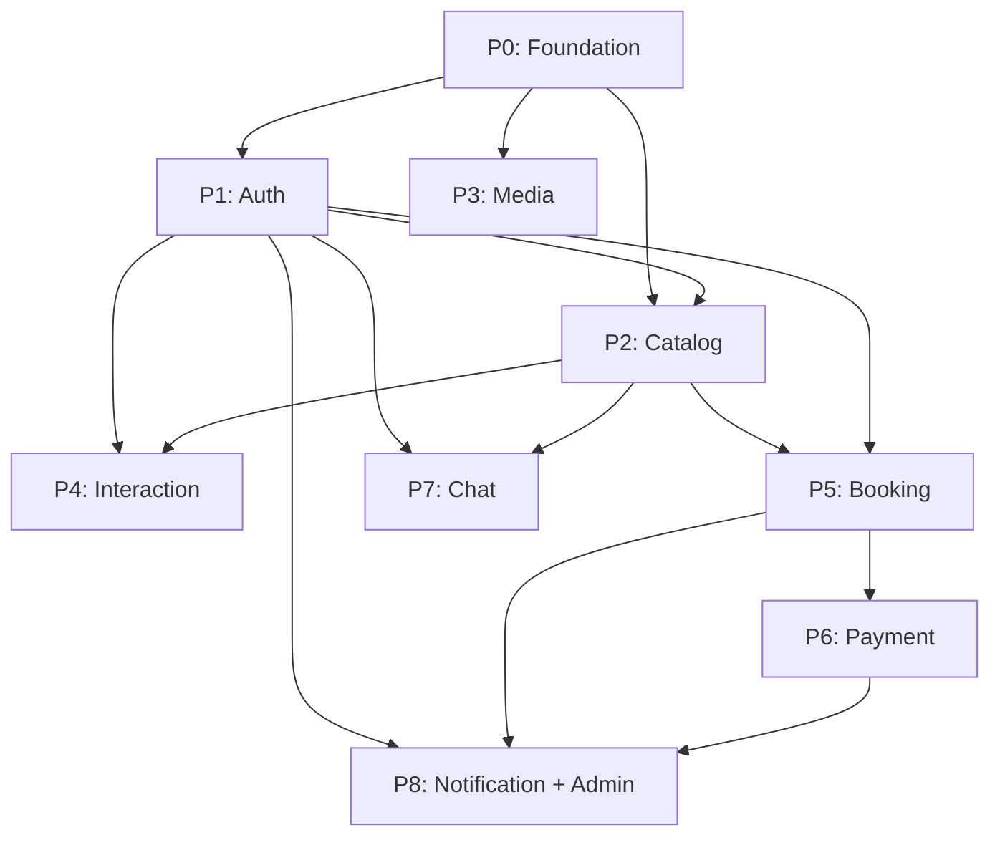

# 🗓️ BACKEND DEVELOPMENT SCHEDULE — Room Rental System

**Ngày tạo:** 24/09/2026  
**Tech Stack:** Java 17 + Spring Boot 3.3.2 + Maven + MySQL 8.4 + MinIO + FCM outbox  
**Contract Version hiện tại:** 1.6

> **Hoàn thiện backend 05/10/2026:** Xem [BACKEND_COMPLETION.md](BACKEND_COMPLETION.md) cho kết quả auth, xóa tài khoản, retention và kiểm chứng vận hành. Global HTTP wrapper tiếp tục giữ format v1.5. Lịch/ước lượng ban đầu bên dưới là kế hoạch lịch sử.

---

## 📊 Tổng quan Phase & Ước lượng Token

| Phase | Tên | Module chính | Ưu tiên | Ước lượng Token | Phụ thuộc |
|-------|-----|-------------|---------|----------------|-----------|
| **P0** | Foundation & Infra | `common`, config, docker | 🔴 Critical | ~15K tokens | Không |
| **P1** | Auth & User | `auth` | 🔴 Critical | ~25K tokens | P0 |
| **P2** | Catalog (Room + Listing) | `catalog` | 🔴 Critical | ~30K tokens | P0, P1 |
| **P3** | Media Upload | `media` | 🟡 High | ~12K tokens | P0, P1 |
| **P4** | Interaction (Viewing + Review + Report) | `interaction` | 🟡 High | ~20K tokens | P0–P2 |
| **P5** | Booking & State Machine | `booking` | 🔴 Critical | ~35K tokens | P0–P2 |
| **P6** | Payment (Mock Sandbox) | `payment` | 🟡 High | ~20K tokens | P0, P1, P5 |
| **P7** | Chat & WebSocket | `chat` | 🟢 Medium | ~25K tokens | P0, P1, P2 |
| **P8** | Notification + Admin + Jobs | `notification`, `admin` | 🟢 Medium | ~20K tokens | P0–P6 |

**Tổng ước lượng:** ~200K tokens (chia ~8 phiên làm việc)

---

## 🎯 Chiến lược chia Token cho AI Agent

> [!IMPORTANT]
> **Nguyên tắc vàng:** Mỗi phiên (conversation) nên tập trung vào **1 Phase duy nhất**. Không nên nhồi quá 30K–35K tokens code generation vào một phiên để tránh giảm chất lượng output.

### Cách chia token tối ưu:

| Phiên | Nội dung | Token budget | Ghi chú |
|-------|----------|-------------|---------|
| **Phiên 1** | P0 + P1 (Foundation + Auth) | ~35K | Nền tảng, không thể bỏ qua |
| **Phiên 2** | P2 (Catalog: Room + Listing + Discovery) | ~30K | Module lớn nhất, chia riêng |
| **Phiên 3** | P3 + P4 (Media + Interaction) | ~30K | 2 module nhỏ, gom lại |
| **Phiên 4** | P5 (Booking + State Machine) | ~35K | Logic phức tạp nhất, cần riêng |
| **Phiên 5** | P6 (Payment + Webhook + Refund) | ~20K | Phụ thuộc P5, logic tài chính |
| **Phiên 6** | P7 (Chat + STOMP WebSocket) | ~25K | Realtime, cần focus |
| **Phiên 7** | P8 (Notification + Admin + Jobs) | ~20K | Tổng hợp, cross-module |
| **Phiên 8** | Integration Test + Polish | ~15K | Test E2E, fix gaps |

> [!TIP]
> **Mẹo hiệu quả:** Mỗi phiên mới, bạn chỉ cần gửi lại các file contract liên quan + cấu trúc thư mục hiện tại. Không cần gửi lại toàn bộ contract.

---

## 📋 Chi tiết từng Phase

### Phase 0: Foundation & Infrastructure (~15K tokens)

**Mục tiêu:** Dựng skeleton project, config cơ bản, Docker Compose, Flyway migration base.

| # | Task | File/Folder cần tạo | Business Rule |
|---|------|---------------------|---------------|
| 0.1 | Init Spring Boot project (Maven) | `pom.xml`, `src/main/java/com/app/RentalApplication.java` | — |
| 0.2 | Docker Compose (MySQL + MinIO + FCM outbox + Zookeeper) | `docker-compose.yml` | — |
| 0.3 | Application config (profiles) | `application.yml`, `application-dev.yml` | — |
| 0.4 | Global Exception Handler (RFC 9457) | `common/exception/GlobalExceptionHandler.java`, `common/dto/ProblemDTO.java`, `common/dto/FieldErrorDTO.java` | §6 Error Format |
| 0.5 | Base Entity (id, timestamps, version) | `common/entity/BaseEntity.java` | — |
| 0.6 | Idempotency Filter | `common/idempotency/IdempotencyFilter.java`, `common/idempotency/IdempotencyKeyEntity.java` | BR-12 |
| 0.7 | Flyway baseline migration | `db/migration/V1__baseline.sql` | §2 Data Model |
| 0.8 | Pagination DTO | `common/dto/PageResponse.java` | §3 Pagination |
| 0.9 | Audit config | `common/audit/AuditConfig.java` | — |

---

### Phase 1: Auth & User Management (~25K tokens)

**Mục tiêu:** Đăng ký, đăng nhập, JWT, refresh token, logout, email verification, profile, session.

| # | Task | API Code | File chính | BR |
|---|------|----------|-----------|-----|
| 1.1 | User Entity + Role enum | — | `auth/entity/User.java`, `auth/entity/UserRole.java` | BR-01 |
| 1.2 | Register | AUTH01 | `auth/controller/AuthController.java`, `auth/service/AuthService.java` | §1.2 |
| 1.3 | Login + JWT generation | AUTH02 | `auth/security/JwtProvider.java`, `auth/security/JwtFilter.java` | SEC-01 |
| 1.4 | Refresh Token | AUTH03 | `auth/entity/RefreshToken.java`, `auth/service/TokenService.java` | SEC-02 |
| 1.5 | Logout (revoke session) | AUTH04 | Service method | SEC-02 |
| 1.6 | Email Verification flow | AUTH05–06 | `auth/entity/OneTimeToken.java`, `auth/service/EmailService.java` | SEC-03 |
| 1.7 | Get/Update Profile | AUTH07–08 | `auth/controller/ProfileController.java` | §1.2 |
| 1.8 | Device Token (FCM) | AUTH10 | `auth/entity/DeviceToken.java` | — |
| 1.9 | Notification Preferences | AUTH11 | `auth/entity/NotificationPreference.java` | — |
| 1.10 | Delete Account Request | AUTH12 | `auth/service/AccountDeletionService.java` | §2.8 |
| 1.11 | Security Config (Spring Security) | — | `auth/security/SecurityConfig.java` | SEC-04 |
| 1.12 | Flyway migrations (users, sessions, tokens) | — | `V2__auth_tables.sql` | §2.1 |

---

### Phase 2: Catalog — Room + Listing + Discovery (~30K tokens)

**Mục tiêu:** CRUD Room, CRUD Listing, Search/Filter, Wishlist, Location/Amenity.

| # | Task | API Code | File chính | BR |
|---|------|----------|-----------|-----|
| 2.1 | Room Entity + Enums | — | `catalog/entity/Room.java`, `catalog/entity/RoomType.java`, `catalog/entity/RoomAvailability.java` | BR-01 |
| 2.2 | Create/Update Room | HOST01–02 | `catalog/controller/RoomController.java`, `catalog/service/RoomService.java` | BR-01 |
| 2.3 | Listing Entity + Status enum | — | `catalog/entity/Listing.java`, `catalog/entity/ListingStatus.java` | BR-02 |
| 2.4 | Create/Update/Submit Listing | CAT01–04 | `catalog/controller/ListingController.java`, `catalog/service/ListingService.java` | BR-02 |
| 2.5 | Search Listings (filter, sort, geo) | CAT05 | `catalog/service/ListingSearchService.java` | BR-03 |
| 2.6 | Get Listing Detail | CAT07 | Reuse controller | BR-04 |
| 2.7 | Listing Fee management | CAT08–10 | `catalog/entity/ListingFee.java`, `catalog/service/FeeService.java` | BR-04 |
| 2.8 | Wishlist (Save/Unsave) | CAT11–13 | `catalog/entity/WishlistItem.java`, `catalog/controller/WishlistController.java` | — |
| 2.9 | Amenity CRUD | CAT14 | `catalog/entity/Amenity.java` | — |
| 2.10 | Address + GeoPoint | — | `catalog/entity/Address.java`, `catalog/entity/GeoPoint.java` | — |
| 2.11 | Host Room List | HOST03–04 | Reuse controller | — |
| 2.12 | Flyway migrations | — | `V3__catalog_tables.sql` | §2.2, §2.3 |

---

### Phase 3: Media Upload (~12K tokens)

**Mục tiêu:** Upload ảnh/video lên MinIO, gắn vào Listing/Room, cleanup job.

| # | Task | API Code | File chính | BR |
|---|------|----------|-----------|-----|
| 3.1 | Media Entity | — | `media/entity/Media.java`, `media/entity/MediaPurpose.java` | §2.3 |
| 3.2 | Upload endpoint | MEDIA01 | `media/controller/MediaController.java`, `media/service/MediaService.java` | BR-09 |
| 3.3 | MinIO client config | — | `media/config/MinIOConfig.java`, `media/service/S3StorageService.java` | — |
| 3.4 | Magic bytes validation | — | `media/validation/FileValidator.java` | SEC-05 |
| 3.5 | Signed URL generation | — | Trong service | — |
| 3.6 | Cleanup Job (orphan files) | — | `media/job/OrphanMediaCleanupJob.java` | BR-13 |
| 3.7 | Flyway migration | — | `V4__media_tables.sql` | §2.3 |

---

### Phase 4: Interaction — Viewing + Review + Report (~20K tokens)

**Mục tiêu:** Hẹn xem phòng, đánh giá, báo cáo vi phạm.

| # | Task | API Code | File chính | BR |
|---|------|----------|-----------|-----|
| 4.1 | ViewingSlot + Viewing Entity | — | `interaction/entity/ViewingSlot.java`, `interaction/entity/Viewing.java` | BR-05 |
| 4.2 | Viewing CRUD + State Machine | VIEW01–08 | `interaction/controller/ViewingController.java`, `interaction/service/ViewingService.java` | BR-05 |
| 4.3 | Review Entity | — | `interaction/entity/Review.java` | BR-10 |
| 4.4 | Review CRUD | REV01–04 | `interaction/controller/ReviewController.java`, `interaction/service/ReviewService.java` | BR-10 |
| 4.5 | Report Entity | — | `interaction/entity/Report.java` | BR-14 |
| 4.6 | Report CRUD | RPT01–02 | `interaction/controller/ReportController.java` | BR-14 |
| 4.7 | Flyway migration | — | `V5__interaction_tables.sql` | §2.4 |

---

### Phase 5: Booking & State Machine (~35K tokens) ⚠️ Complex

**Mục tiêu:** Booking lifecycle hoàn chỉnh: tạo → duyệt → cọc → xác nhận → bàn giao → hoàn thành/hủy.

| # | Task | API Code | File chính | BR |
|---|------|----------|-----------|-----|
| 5.1 | Booking Entity + Status enum | — | `booking/entity/Booking.java`, `booking/entity/BookingStatus.java` | BR-06 |
| 5.2 | Booking State Machine | — | `booking/statemachine/BookingStateMachine.java` | BR-06 |
| 5.3 | Create Booking | BOOK01 | `booking/controller/BookingController.java`, `booking/service/BookingService.java` | BR-06, BR-07 |
| 5.4 | List Bookings (Tenant/Host) | BOOK02–03 | Reuse controller | — |
| 5.5 | Approve/Reject Booking | BOOK04–05 | Service methods | BR-06, BR-07 |
| 5.6 | Confirm Deposit (link Payment) | BOOK06 | Service method | BR-06 |
| 5.7 | Handover (Tenant + Host confirm) | BOOK07–08 | Service methods | BR-06 |
| 5.8 | Cancel Booking | BOOK09 | Service method | BR-06 |
| 5.9 | BookingCase (Dispute) | CASE01–03 | `booking/entity/BookingCase.java`, `booking/service/BookingCaseService.java` | BR-15 |
| 5.10 | Booking Status History | — | `booking/entity/BookingStatusHistory.java` | §2.4 |
| 5.11 | Terms Snapshot logic | — | `booking/service/TermsSnapshotService.java` | BR-06 |
| 5.12 | Optimistic Locking integration | — | Exception handling | BR-07, C01–C02 |
| 5.13 | Flyway migration | — | `V6__booking_tables.sql` | §2.4 |

> [!WARNING]
> Phase 5 là **phức tạp nhất** của toàn dự án. State machine booking có 6 trạng thái + nhiều transition + concurrency rules. **Nên dành riêng 1 phiên đầy đủ** cho phase này.

---

### Phase 6: Payment — Mock Sandbox (~20K tokens)

**Mục tiêu:** Tạo payment link mock, xử lý webhook, refund, late settlement.

| # | Task | API Code | File chính | BR |
|---|------|----------|-----------|-----|
| 6.1 | Payment Entity + Status | — | `payment/entity/Payment.java`, `payment/entity/PaymentStatus.java` | §2.5 |
| 6.2 | Create Payment (Mock) | PAY01 | `payment/controller/PaymentController.java`, `payment/service/PaymentService.java` | BR-08 |
| 6.3 | Mock Webhook receiver | PAY02 | `payment/controller/WebhookController.java` | BR-08 |
| 6.4 | Webhook dedup + Pessimistic Lock | — | `payment/service/WebhookProcessor.java` | C03 |
| 6.5 | Refund Entity + flow | — | `payment/entity/Refund.java`, `payment/service/RefundService.java` | BR-08 |
| 6.6 | Late Settlement handling | — | Logic in service | C04, E2E-04 |
| 6.7 | Webhook Receipt logging | — | `payment/entity/PaymentWebhookReceipt.java` | §2.5 |
| 6.8 | Flyway migration | — | `V7__payment_tables.sql` | §2.5 |

---

### Phase 7: Chat & WebSocket (~25K tokens)

**Mục tiêu:** Conversation, Message, STOMP realtime, read markers.

| # | Task | API Code | File chính | BR |
|---|------|----------|-----------|-----|
| 7.1 | Conversation + Message Entity | — | `chat/entity/Conversation.java`, `chat/entity/Message.java` | BR-11 |
| 7.2 | Create/List Conversations | CHAT01–03 | `chat/controller/ChatController.java`, `chat/service/ChatService.java` | BR-11 |
| 7.3 | List Messages (cursor pagination) | CHAT04 | Service method | §7.2 |
| 7.4 | STOMP Config + Handlers | — | `chat/websocket/StompConfig.java`, `chat/websocket/ChatStompHandler.java` | SEC-05 |
| 7.5 | Send message via STOMP | CHAT-WS | `chat/websocket/ChatStompHandler.java` | BR-11 |
| 7.6 | Read Marker | CHAT05 | `chat/entity/ReadMarker.java` | — |
| 7.7 | JWT Handshake interceptor | — | `chat/websocket/JwtHandshakeInterceptor.java` | SEC-05 |
| 7.8 | Flyway migration | — | `V11__chat_tables.sql` | §2.6 |

---

### Phase 8: Notification + Admin + Scheduled Jobs (~20K tokens)

**Mục tiêu:** FCM push, MySQL outbox worker, Admin moderation, Cron jobs.

| # | Task | API Code | File chính | BR |
|---|------|----------|-----------|-----|
| 8.1 | Notification Entity | — | `notification/entity/Notification.java` | — |
| 8.2 | MySQL outbox worker + FCM push | — | `notification/consumer/NotificationConsumer.java`, `notification/service/FcmService.java` | — |
| 8.3 | Notification list API | NOTIF01–03 | `notification/controller/NotificationController.java` | — |
| 8.4 | Outbox Event publisher | — | `common/outbox/OutboxEvent.java`, `common/outbox/OutboxPublisher.java` | BR-12 |
| 8.5 | Admin: Approve/Hide Listing | ADMIN01–02 | `admin/controller/AdminController.java`, `admin/service/AdminService.java` | BR-02 |
| 8.6 | Admin: Resolve BookingCase | ADMIN05 | Service method | BR-15 |
| 8.7 | Admin: Suspend User | ADMIN04 | Service method | SEC-04 |
| 8.8 | Scheduled Jobs (Expire Booking, Listing, Handover overdue) | — | `booking/job/BookingExpirationJob.java`, `catalog/job/ListingExpirationJob.java` | BR-13 |
| 8.9 | Audit Log Entity | — | `common/audit/AuditLog.java` | §2.7 |
| 8.10 | Flyway migration | — | `V12__notification_admin_tables.sql`, `V13__add_user_suspended.sql` | §2.7, §2.8 |

---

## 🔄 Dependency Graph

---

## 📌 Quy tắc khi chạy từng phiên

> [!NOTE]
> **Cho mỗi phiên AI coding, bạn nên:**
> 1. Gửi kèm file contract liên quan (chỉ cần phần relevant, không cần toàn bộ)
> 2. Gửi cấu trúc thư mục hiện tại (`tree` hoặc list dir)
> 3. Nêu rõ Phase nào cần code
> 4. Sau khi hoàn thành, chạy `mvn compile` để verify trước khi qua phase tiếp

### Checklist nghiệm thu mỗi Phase:

- [ ] Code compile thành công (`mvn compile`)
- [ ] Flyway migration chạy được
- [ ] Các endpoint test thủ công qua Postman/curl OK
- [ ] Exception handling đúng RFC 9457
- [ ] Optimistic locking trên entity cần thiết
- [ ] Idempotency cho POST mutation endpoints

---

## 📈 Trạng thái tiến độ

| Phase | Trạng thái | Ngày bắt đầu | Ngày hoàn thành |
|-------|-----------|-------------|-----------------|
| P0 | Có implementation; nghiệm thu theo IMPLEMENTATION_STATUS.md | 24/09/2026 | 24/09/2026 |
| P1 | Có implementation; nghiệm thu theo IMPLEMENTATION_STATUS.md | 24/09/2026 | 25/09/2026 |
| P2 | Có implementation; nghiệm thu theo IMPLEMENTATION_STATUS.md | 24/09/2026 | 25/09/2026 |
| P3 | Có implementation; nghiệm thu theo IMPLEMENTATION_STATUS.md | 26/09/2026 | 26/09/2026 |
| P4 | Có implementation; nghiệm thu theo IMPLEMENTATION_STATUS.md | 26/09/2026 | 26/09/2026 |
| P5 | Có implementation; nghiệm thu theo IMPLEMENTATION_STATUS.md | 26/09/2026 | 26/09/2026 |
| P6 | Có implementation; nghiệm thu theo IMPLEMENTATION_STATUS.md | 26/09/2026 | 26/09/2026 |
| P7 | ✅ Hoàn thành backend chat TEXT; kiểm chứng tại codex24th9.md | 26/09/2026 | 28/09/2026 |
| P8 | 🔄 Admin + inbox đã kiểm chứng; đã có outbox/FCM code; còn push thật và nghiệm thu triển khai | 27/09/2026 | — |
> **Cập nhật 03/10/2026:** Hiện trạng triển khai và các quyết định thay thế mô tả cũ nằm tại [IMPLEMENTATION_STATUS.md](IMPLEMENTATION_STATUS.md). FCM dùng MySQL outbox; hướng dẫn tại [FIREBASE_SETUP.md](FIREBASE_SETUP.md). Các mốc kiểm chứng trước đây là lịch sử, không phải nghiệm thu bản hiện tại.
